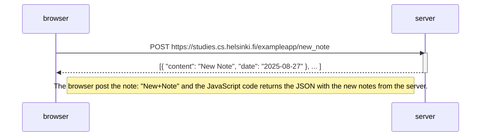

```mermaid
sequenceDiagram
    participant browser
    participant server

    browser->>server: POST https://studies.cs.helsinki.fi/exampleapp/new_note
    activate server
    server-->>browser: [{ "content": "New Note", "date": "2025-08-27" }, ... ]
    deactivate server

    Note right of browser: The browser post the note: "New+Note" and the JavaScript code returns the JSON with the new notes from the server.
```