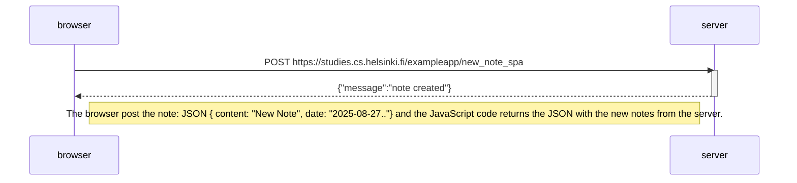

```mermaid
sequenceDiagram
    participant browser
    participant server

    browser->>server: POST https://studies.cs.helsinki.fi/exampleapp/new_note_spa
    activate server
    server-->>browser: {"message":"note created"}
    deactivate server

    Note right of browser: The browser post the note: JSON { content: "New Note", date: "2025-08-27.."} and the JavaScript code returns the JSON with the new notes from the server.
```